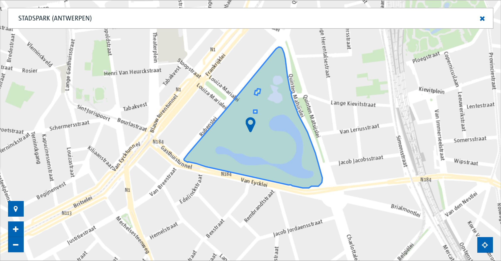

# ACPaaS UI Smart Widgets

## Welkom

Smart Widgets maken deel uit van het Digipolis DXP, of Digital eXperience Platform, en bouwen voort bovenop de [ACPaaS UI](https://acpaas-ui.digipolis.be) componenten.

Op deze plek vind je alles terug over het gebruiken en maken van Smart Widgets.

## Inhoud

- [Wat is een Smart Widget?](#wat-is-een-smart-widget)
- [Een widget gebruiken](#een-widget-gebruiken)
- [Een widget (ver)bouwen](#een-widget-verbouwen)
- [Huidige widgets](#huidige-widgets)
- [Embeddable Widgets](#embeddable-widgets)

## Wat is een Smart Widget?

Een Smart Widget is een front-end component die een concrete end-to-end functionaliteit encapsuleert en gebruikt wordt als onderdeel om een View in een App te bouwen. De Widget bestaat uit een UI component en een bijbehorende service die de doorverbinding maakt met achterliggende systemen.

Dit past in de referentie-architectuur [SA2020](https://docs.google.com/presentation/d/1F5xLAm7IqepLyBJMswdLXtkD-Epa_xL-iUJfu-k-Kdc/edit?usp=drive_web&ouid=110795847601970524262) en ziet er als volgt uit:

De Smart Widget bestaat uit volgende delen:

- UI - widget user interface voorgekoppeld op de BFF
- BFF - een backend-for-frontend service die de widget gaat verbinden met achterliggende systemen (API's en databronnen)

Bij het bouwen van de BFF voor een applicatie maakt de ontwikkelaar hergebruik van de voorverpakte Smart Widget functionaliteit.

Klik door naar de [lijst van Smart Widgets](#huidige-widgets) om voorbeelden te zien.

## Een widget gebruiken

Een Smart Widget gebruik je door volgende zaken te doen:

1. Includeer en configureer de back-end

    In je BFF code ga je de back-end package voor de Smart Widget includeren en de instructies uit de README ervan volgen om een werkende BFF te maken die gebruikt kan worden door de Smart Widget front-end.

2. Includeer en configureer de front-end

    In je applicatie front-end code ga je de front-end package voor de Smart Widget includeren en ook hier weer de instructies uit de README ervan volgen om die te verbinden met de BFF en gepast te configureren voor je noden.

Kijk bij de lijst van widgets hieronder welke packages ter beschikking zijn voor elke widget.

### Afwerkingsniveaus

Een Smart Widget kent verschillende stadia van afwerking, en in functie daarvan kan je de keuze maken of de widget de juiste is voor jouw applicatie:

- 

  De widget is in actieve ontwikkeling maar nog niet klaar voor gebruik. Hou deze pagina in de gaten!

- 

  De widget is klaar, maar is nog niet opgenomen in de Digipolis organisatie op github en voldoet mogelijk nog niet aan de basisvereisten rond kwaliteit.

- 

  De widget is klaar voor gebruik.

- 

  De widget is niet langer ondersteund.

De widgets zijn ontworpen om gecombineerd te worden met de [merkarchitectuur](https://www.antwerpen.be/nl/overzicht/merk-en-huisstijl-1/digitale-componenten/technische-informatie) van de stad Antwerpen.

## Een widget (ver)bouwen

Wil je een Smart Widget maken of verrijken met bijkomende functionaliteit, of wil je gewoon een suggestie doen of een bug melden, bekijk dan even onze [contributiegids](CONTRIBUTING.md).

In elk geval ben je op voorhand al enorm bedankt voor jouw hulp! :+1:

## Huidige widgets

| Widget | Status |
|--------|--------|
| [Contact Picker](#contact-picker) |  |
| [Location Picker](#location-picker) |  |
| [Chatbot](#chatbot) |  |
| [Smart Table / Dossier Viewer](#smart-table) |  |

### Contact Picker

Een selectieveld om een persoon uit te kiezen, met standaardkoppeling op het M-profiel en mogelijkheid om extra databronnen aan te koppelen.

Packages:

- [Angular 5+ UI](https://github.com/digipolisantwerp/contact-picker_widget_angular)
- [Node.JS BFF](https://github.com/digipolisantwerp/contact-picker_service_nodejs)

### Location Picker

Een selectieveld om een straat, adres of plaats uit te kiezen, gekoppeld op de GIS databron van straten en adressen in Antwerpen. Kan getoond worden met en zonder kaart en heeft uitgebreide mogelijkheden tot customisatie.

Packages:

- [Angular 5+ UI](https://github.com/digipolisantwerp/location-picker_widget_angular)

### Chatbot

Een chat UI die verbonden is met een chatbot in de chatbot engine.

- [Angular 5+ UI](https://github.com/digipolisantwerp/chatbot_widget_angular)
- [AngularJS 1.2 UI](https://github.com/digipolisantwerp/chatbot_widget_ng1)
- [Node.JS BFF](https://github.com/digipolisantwerp/chatbot_service_nodejs)

### Smart Table / Dossier Viewer

Een generieke front-end voor het tonen van filterbare, sorteerbare, paginerende lijsten van dingen. De front-end is zelfconfigurerend via data aangeleverd door de backend.

- [Angular 6+ UI](https://github.com/digipolisantwerp/smart-table_widget_angular)

## Embeddable Widgets

Smart Widgets dien je te integreren in je frontend codebase, wat maakt dat ze beschikbaar moeten zijn voor hetzelfde frontend framework als waarin je werkt. Voor gevallen waar dit niet kan hebben we ook embeddable widgets. Dit is een manier om via iframes stukken functionaliteit toe te voegen aan een applicatie, zelfs als die geschreven is in een andere frontend-technologie en wordt die gehost door een andere applicatie.

- [Embeddable widgets library](https://github.com/digipolisantwerp/embeddable-widgets_module_js)
- [Standaardwidgets in de widgets app](https://widgets.antwerpen.be/)
